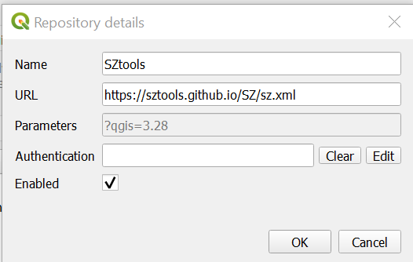
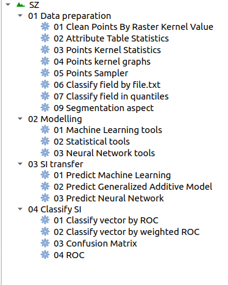
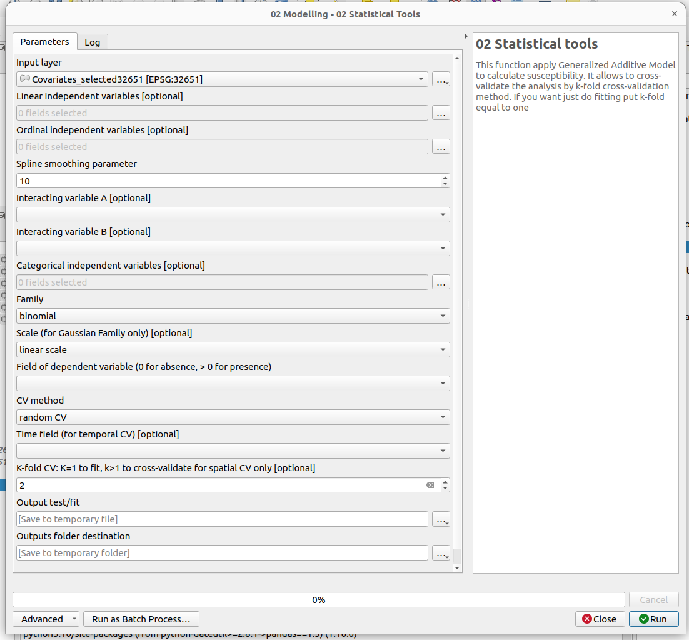
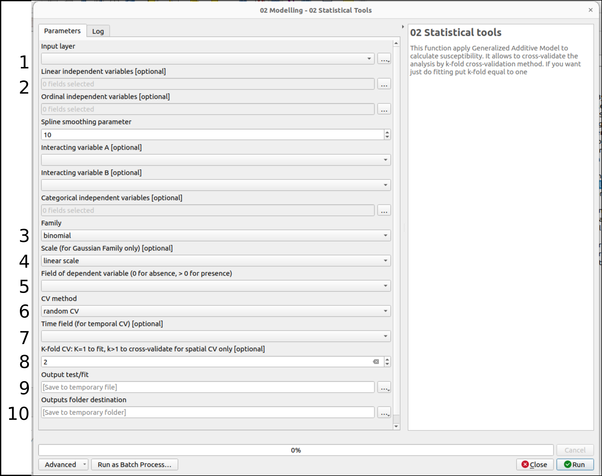
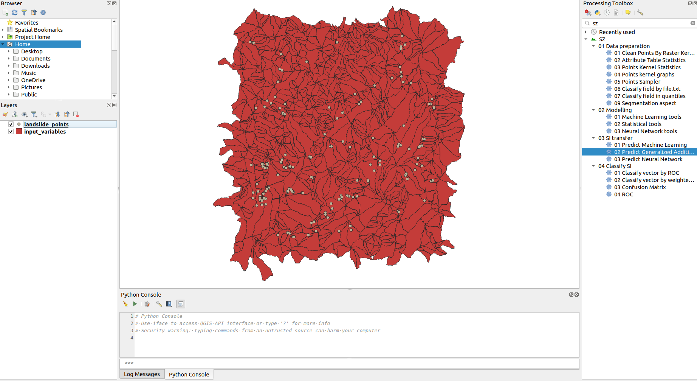

# Susceptibility Zoning plugin (SZ)

The latest plugin docs are available to: https://sz-docs.readthedocs.io

Plugin repository: https://github.com/SZtools/SZ-plugin

## Introduction

This repository contains the code for a [QGIS](https://www.qgis.org) plugin, called "Susceptibility Zoning plugin" (SZ-plugin), aiming at creating maps of susceptibility to various natural forcing elements.

The plugin has been developed with a main focus and application towards landslides susceptibility, but it can be applied to different types of natural events or inter-disciplinary applications.

The plugin uses several type of statistical, machine learning models for susceptibility evaluation, such as:

* Generalized Additive Model with two distributions: Binomial, Gaussian (see [pygam](https://pygam.readthedocs.io))
* Decision Tree (see [scikit-learn](https://scikit-learn.org/stable/modules/generated/sklearn.tree.DecisionTreeClassifier.html))
* Support Vector Machine (see [scikit-learn](https://scikit-learn.org/stable/modules/generated/sklearn.svm.SVC.html))
* Random Forest (see [scikit-learn](https://scikit-learn.org/stable/modules/generated/sklearn.ensemble.RandomForestClassifier.html#sklearn.ensemble.RandomForestClassifier))
* Multi-layer Perceptron as classifier (see [scikit-learn](https://scikit-learn.org/stable/modules/generated/sklearn.neural_network.MLPClassifier.html#sklearn.neural_network.MLPClassifier)) and regressor (see [scikit-learn](https://scikit-learn.org/stable/modules/generated/sklearn.neural_network.MLPRegressor.html#sklearn.neural_network.MLPRegressor))

The plugin allows the user to perform spatial and temporal analysis implementing space-time cross-validation (CV) methods: 

* Kfold CV (see [scikit-learn](https://scikit-learn.org/stable/modules/generated/sklearn.model_selection.KFold.html))
* Spatial CV (see [Elia et al., 2023](https://doi.org/10.1016/j.scitotenv.2023.165289))
* Time Series Split temporal-CV (see [scikit-learn](https://scikit-learn.org/stable/modules/generated/sklearn.model_selection.TimeSeriesSplit.html))
* Leave One Out temporal-CV (see [scikit-learn](https://scikit-learn.org/stable/modules/generated/sklearn.model_selection.LeaveOneOut.html))
* Space-time CV (Leave One Out/Spatial CV)

Moreover the plugin allows the user to run space-time transferability with all the models implemented.

## Installation

The SZ plugin is not an official QGIS plugin.

#### Minimum requirements

Tested on:

* Ubuntu 20.04 - QGIS 3.34
* Ubuntu 22.04 - QGIS 3.34
* Windows 10 - QGIS 3.28/QGIS 3.34
* MacOS Sonoma 14.4 - QGIS 3.28

#### Download and install

It can be installed on QGIS >= 3.28 adding the Plugin Repository to QGIS ```manage and install plugins```:

- add plugin repository


- edit repository and add [https://sztools.github.io/SZ/sz.xml](https://sztools.github.io/SZ/sz.xml)


<p>

or

cloning the [GitHub repository](https://github.com/SZtools/SZ-plugin) or downloading it as zip file (and than unzipping it) and copying the ```sz_module``` folder in your local ```python/plugin``` folder (read [here](https://docs.qgis.org/3.10/en/docs/user_manual/plugins/plugins.html#core-and-external-plugins) for more information).

Lunch QGIS 3.x, and abilitate the plugin from ```manage and install plugin/installed/sz_processing```


<p>

or

cloning the [GitHub repository](https://github.com/SZtools/SZ-plugin) or downloading it as zip file (and than unzipping it), and zip the folder ```sz_module``` to ```sz_module.zip```. Finally you can install the plugin by using the menu ```install from zip```.


<p>
  
At the end you should have the SZ plugin in your processing toolbox


<p>
  
### GUI

The functions are grouped into 4 cathegories:

* _Data preparation_
* _Modelling_
* _SI transfer_
* _Classify SI_

* _Data preparation_ functions can be used for data pre-processing
* _Modelling_ functions run the statistic models (_Statistical tools_) and machine learning models (_Machine Learning tools_ / _Neural Network tools_) for susceptibility, cross-validate and evaluate the results by several metrics: ROC (AUC), F1 score, Choen's kappa index, Root Meet Square Error, Mean Absolute Error, Squared R, Pearson Correlation
* _SI transfer_ functions run the statistic models (_Statistical tools_) and machine learning models (_Machine Learning tools_ / _Neural Network tools_) for susceptibility, and apply transfer learning in time and space.
* _Classify SI_ functions allows the user to cathegorize the susceptibility index, to run ROC analysis and to perform Confusion Matrix.

All the functions run vector analysis



### Usage

#### Modelling - Statistical Tools



* 1 select the vecor layer to be used as parent layer in the variable selection
* 2 select the independent variabled from the fields of the input layer. Possible format: linear, ordinal (spline fitted), tensors, cathegorical (integer and continuous from 1 to n)
* 3 select the distribution: gaussian or binomial
* 4 if the distribution selected is binomial, all the variables are scaled with a standard scaler. The scale selection is necessary only for gaussian distribution linear (standard scaler) or logaritmic
* 5 select the independent variable. In case of bionomial selection the variable is 0/1, otherwise an ordinal 0/1....n
* 6 select one of the possible CV method
* 7 in case of TSS or LOO or space-time CV selection the Time field is necessary 
* 8 K value selection in case of random, spatial and space-time CV. If k is equal to 1 then a fitting analysis will be conducted
* 9 set the vector file destination
* 10 set the folder destination for the weights, partial effects, plots and metrics outputs 
 
### Test

A dataset and QGIS project are available in [test](./test_data) folder to test the plugin.

 


## Third-part libraries and plugins used

* [scikit-learn](https://scikit-learn.org/stable/index.html)
* pygam
* pandas
* shapely
* fiona
* seaborn


## Tutorial

video tutorial SZ v1.x: https://www.youtube.com/watch?v=XpsiCkVF11s
  
## Application

Titti G, Sarretta A, Lombardo L, Crema S, Pasuto A and Borgatti L (2022) Mapping Susceptibility With Open-Source Tools: A New Plugin for QGIS. Front. Earth Sci. 10:842425. doi: 10.3389/feart.2022.842425
  
[Referenced dataset](https://zenodo.org/record/6575572)

## Publications

_A few examples and references about applications_
  
Titti G, Sarretta A, Lombardo L, Crema S, Pasuto A and Borgatti L (2022) Mapping Susceptibility With Open-Source Tools: A New Plugin for QGIS. Front. Earth Sci. 10:842425. doi: 10.3389/feart.2022.842425

Titti, G., van Westen, C., Borgatti, L., Pasuto, A., & Lombardo, L. (2021). When Enough Is Really Enough? On the Minimum Number of Landslides to Build Reliable Susceptibility Models. Geosciences, 11(11), 469.

Titti, G., Borgatti, L., Zou, Q., Cui, P., & Pasuto, A. (2021). Landslide susceptibility in the Belt and Road Countries: continental step of a multi-scale approach. Environmental Earth Sciences, 80(18), 1-18.[10.1007/s12665-021-09910-1](https://doi.org/10.1007/s12665-021-09910-1)

Titti, G., Borgatti, L., Zou, Q., Pasuto, A., 2019. Small-Scale landslide Susceptibility Assessment. The Case Study of the Southern Asia. Proceedings 30, 14. [10.3390/proceedings2019030014](https://doi.org/10.3390/proceedings2019030014)

## Presentations

_A list of presentations made about the plugin and its applications_

Titti, Giacomo, Sarretta, Alessandro, Crema, Stefano, Pasuto, Alessandro, & Borgatti, Lisa. (2020, March). Sviluppo e applicazione del plugin Susceptibility zoning per il supporto alla pianificazione territoriale. Zenodo. [10.5281/zenodo.3723353](https://zenodo.org/record/3723353)

## Credits

v1.x: Giacomo Titti, Alessandro Sarretta and Luigi Lombardo, Padova, November 2021

please cite: Titti G, Sarretta A, Lombardo L, Crema S, Pasuto A and Borgatti L (2022) Mapping Susceptibility With Open-Source Tools: A New Plugin for QGIS. Front. Earth Sci. 10:842425. doi: 10.3389/feart.2022.842425

v2.x: Giacomo Titti, Luigi Lombardo, Liwei Hu, Pietro Festi, Letizia Elia, Bologna, December 2024

please cite: xxx
  
## Contacts
If you have any problem, please write to giacomotitti@gmail.com or create new issue [here](https://github.com/SZtools/SZ-plugin/issues)

